

  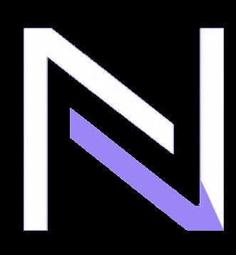
  <h1>Nullsec — Ciclo de Detección de Amenazas con Threat Intelligence</h1>
  
<strong>Proyecto Integrador · SOC / Blue Team</strong>

  
  
  
  
  

    

  

---

## Resumen

**Nullsec** es un laboratorio que demuestra un ciclo completo de detección de amenazas de extremo a extremo: un IOC cargado manualmente en **MISP** termina disparando una **alerta real en el SIEM** tras la ejecución controlada del ransomware **Bad Rabbit** sobre un endpoint Windows.

No se trataba de instalar herramientas, sino de demostrar que la inteligencia de amenazas, la ingesta de telemetría y las reglas de detección se integran y funcionan juntas en producción.

> Fue un proyecto grupal con tres módulos. **Mi rol fue el Módulo 2: el núcleo de detección**, el servidor ELK que conectaba MISP (inteligencia) con la VM víctima (telemetría) y correlacionaba ambas fuentes para producir las alertas.

---

## Arquitectura

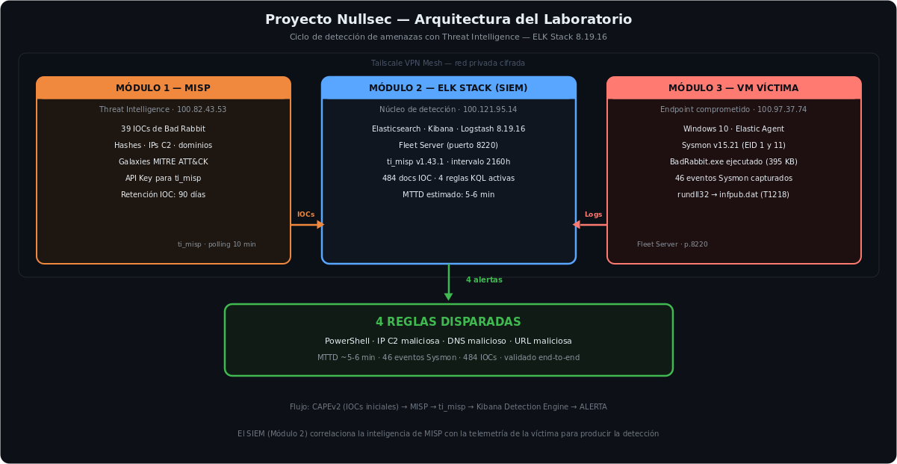

Tres máquinas independientes interconectadas por una **red mesh privada con Tailscale**, cada una a cargo de un módulo:

| Módulo | Rol | Componentes |
|---|---|---|
| **1 — MISP** | Threat Intelligence | IOCs de Bad Rabbit (hashes, IPs C2, dominios), Galaxies MITRE ATT&CK, API para ti_misp |
| **2 — ELK Stack** *(mi módulo)* | **Núcleo de detección (SIEM)** | Elasticsearch · Kibana · Logstash · Fleet Server · ti_misp · 4 reglas KQL |
| **3 — VM Víctima** | Endpoint comprometido | Windows 10 · Elastic Agent · Sysmon · ejecución de BadRabbit.exe |

Los IOCs de Bad Rabbit (hashes, IPs de C2, dominios) provienen del análisis dinámico de la muestra —descargada de **MalwareBazaar** y detonada en un sandbox **CAPEv2**— y se cargaron manualmente en MISP (Módulo 1). Ese es el punto de partida de la inteligencia que mi SIEM (Módulo 2) consume y correlaciona.

---

## Mi trabajo — El SIEM (Módulo 2)

- **Stack ELK 8.19.16** completo (Elasticsearch, Kibana, Logstash) desplegado y endurecido.
- **Fleet Server** (puerto 8220) para gestión centralizada de los Elastic Agents.
- **Integración ti_misp v1.43.1** para sincronizar IOCs desde MISP hacia el SIEM. Decisión clave: fijar el `Initial interval` en **2160h (90 días)** en vez del valor por defecto (120h), porque los IOCs de Bad Rabbit se habían cargado 37+ días antes de la integración y de otro modo nunca se hubieran sincronizado.
- **4 reglas de detección KQL** en el Detection Engine de Kibana, ejecutándose cada 5 minutos.

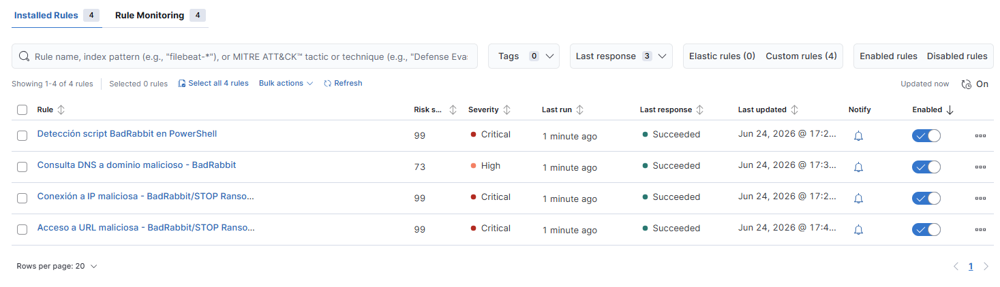

---

## Resultados

Tras la ejecución controlada de Bad Rabbit en la VM víctima, **las 4 reglas dispararon**:

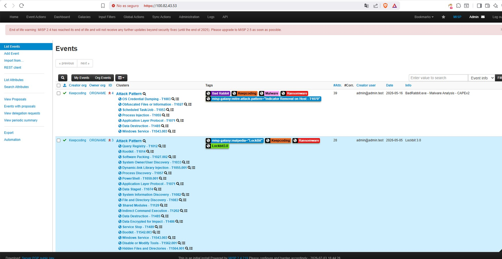

- **MTTD estimado: 5-6 minutos**
- **484** documentos IOC sincronizados vía ti_misp
- **46** eventos Sysmon capturados durante la ejecución
- Detección validada de extremo a extremo: **PowerShell malicioso · IP de C2 · DNS malicioso · URL maliciosa**
- Técnicas mapeadas a MITRE ATT&CK (T1218 rundll32, T1485, T1562.001, entre otras)

---

## Código propio en este repositorio

| Archivo | Qué hace |
|---|---|
| [`reglas-deteccion.kql`](reglas-deteccion.kql) | Las 4 reglas KQL del Detection Engine tal como se configuraron en Kibana Security: script PowerShell de BadRabbit, IP de C2, DNS malicioso, URL maliciosa |

---

## Evidencia del laboratorio

Capturas propias del Módulo 2 (SIEM), de instalación a detección:

| | |
|---|---|
| 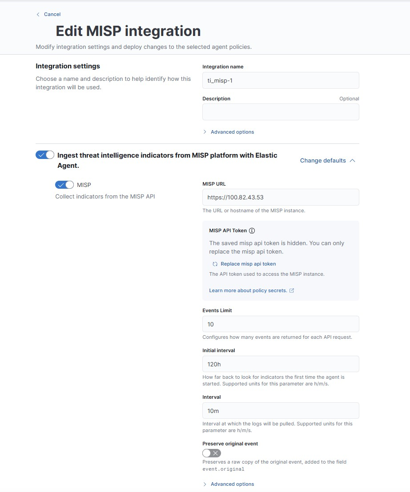 | 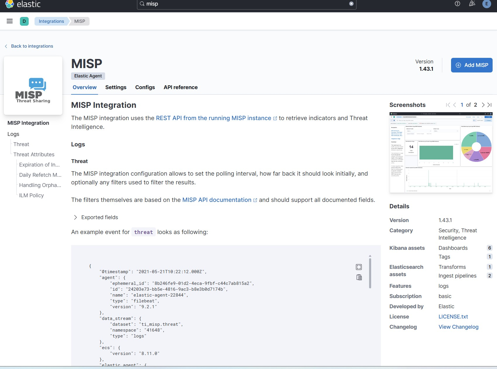 |
| Configuración de la integración ti_misp (MISP URL, intervalo inicial 120h→2160h) | Dashboard de la integración MISP en Kibana |
| 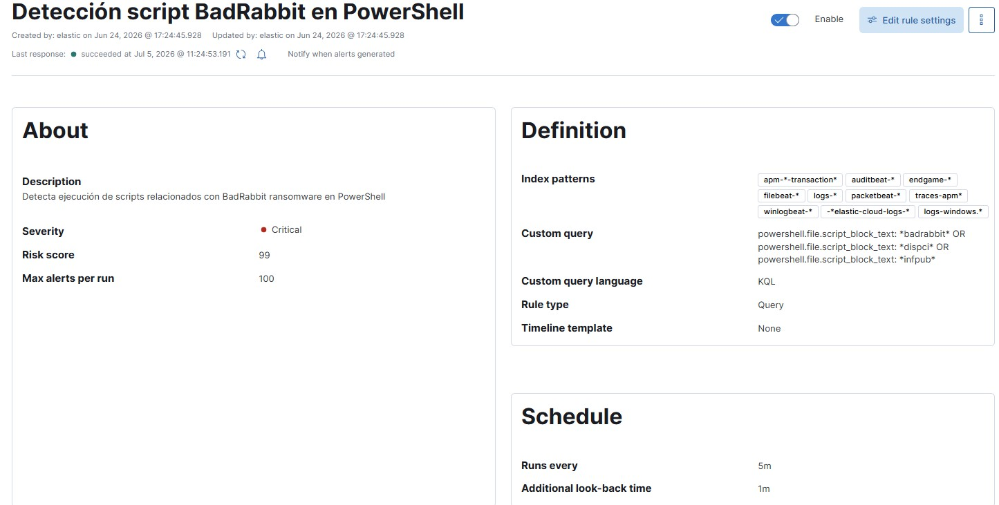 | 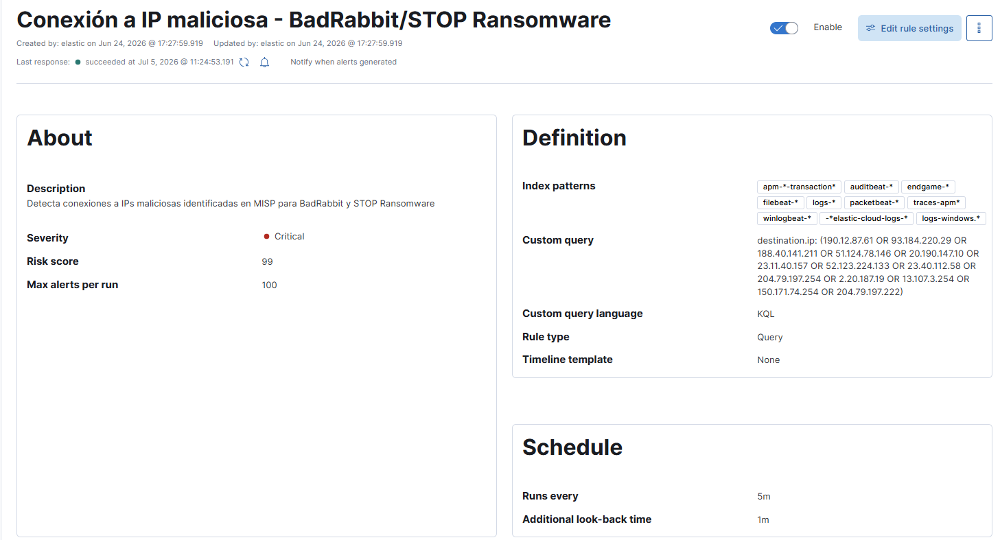 |
| Regla 1 configurada en el Detection Engine | Regla 2 configurada en el Detection Engine |
| 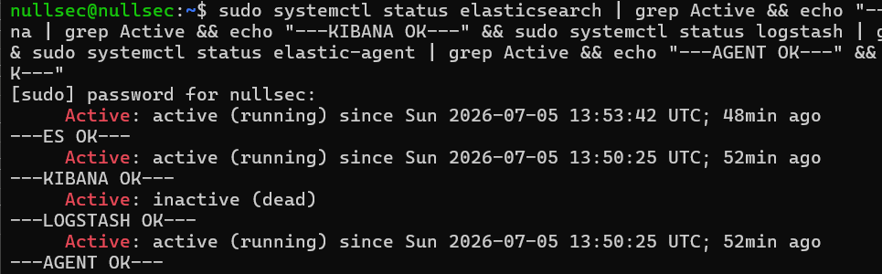 | 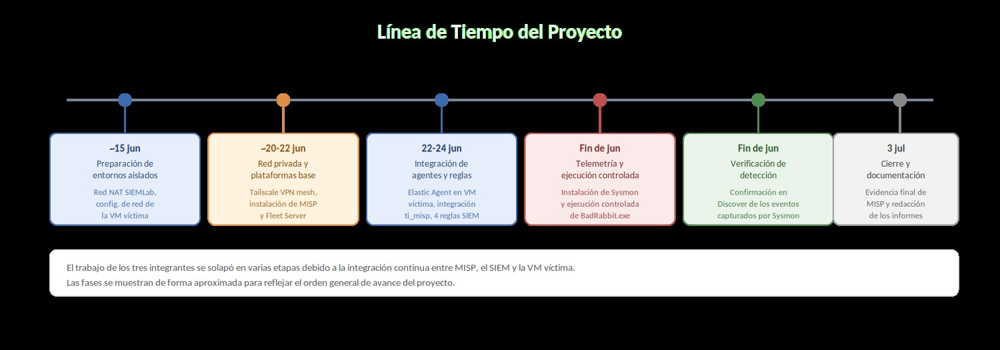 |
| `systemctl status` de Elasticsearch/Kibana/Logstash/Elastic Agent | Línea de tiempo real del proyecto (15 jun – 3 jul) |

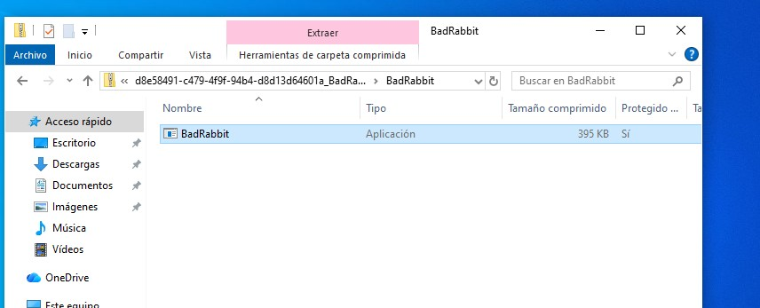
*BadRabbit.exe (395 KB) descargado en la VM víctima antes de la ejecución controlada.*

---

## Troubleshooting real

Montar el SIEM no fue lineal. Estos son 5 de los 11 problemas reales que resolví durante la implementación — el tipo de troubleshooting que se repite en cualquier stack ELK/Fleet en producción, no solo en este laboratorio:

| Síntoma | Causa | Solución |
|---|---|---|
| `x509: certificate signed by unknown authority` al conectar ti_misp con MISP | El certificado auto-firmado de MISP no estaba en el trust store del Elastic Agent | `ssl.verification_mode: none` en la configuración de la integración |
| `logs-ti_misp.threat-default` con 0 documentos tras activar la integración | Los IOCs se habían cargado en MISP 37+ días antes; el `Initial interval` por defecto (120h) no llegaba tan atrás | Ampliar el `Initial interval` a 2160h (90 días) |
| Los Elastic Agents no podían alcanzar el Fleet Server por Tailscale | iptables bloqueaba por defecto el rango CGNAT `100.64.0.0/10` que usa Tailscale | Reglas `ACCEPT` explícitas por IP + persistencia con `iptables-save` |
| Kibana se caía inmediatamente al iniciar, error de `encryptionKey` | Elastic 8.x exige 3 claves de cifrado (saved objects, security, reporting) que no estaban generadas | `kibana-encryption-keys generate` e insertarlas en `kibana.yml` |
| Fleet Server devolvía `401 Unauthorized` con el service token | El token se generó antes de que Elasticsearch terminara su inicialización segura | Regenerar el token una vez el cluster estaba en estado `green` |

---

## Limitaciones y mejoras futuras

No se evaluó propagación real del ransomware (movimiento lateral vía SMB, dumping de credenciales) — la ejecución se limitó a un único host aislado, y no se incorporó un SOAR, así que la respuesta a las alertas fue observación, no automatización.

Mejoras identificadas: feeds automáticos de MISP para no depender de carga manual de IOCs, un segundo host víctima para evaluar cobertura de detección ante movimiento lateral, e integrar un SOAR (Shuffle o TheHive) para automatizar la respuesta a alertas críticas.

---

## Stack técnico

`Elasticsearch` · `Kibana` · `Logstash` · `Fleet Server` · `Elastic Agent` · `ti_misp` · `MISP` · `Sysmon v15.21` · `Tailscale VPN` · `CAPEv2` · `MITRE ATT&CK` · `KQL`

---

## Aprendizajes

- La detección efectiva no depende de una sola herramienta, sino de la **correlación** entre inteligencia (MISP) y telemetría (Sysmon) a través del SIEM.
- Un detalle de configuración (el intervalo de sincronización) puede ser la diferencia entre detectar o no detectar una amenaza real.
- Diseñar reglas KQL exige entender tanto la técnica ofensiva (cómo actúa el ransomware) como la fuente de datos (qué evento genera cada acción).

---

## Módulos relacionados

Este proyecto es el **integrador** del bootcamp: reúne en un solo laboratorio lo aprendido por separado en cada módulo.

- **[Blue Team](https://github.com/juanmalbran/Blue-Team)** — la base del SIEM: segmentación de red, Fleet y análisis de logs que aquí se llevan a detección real.
- **[Análisis de Malware](https://github.com/juanmalbran/Analisis-de-Malware)** — el análisis de Bad Rabbit (estático, dinámico y YARA) que produce los IOCs cargados en MISP.
- **[DFIR](https://github.com/juanmalbran/DFIR)** — el paso siguiente a la alerta: adquisición, análisis forense y respuesta al incidente detectado.
- **[Red Team](https://github.com/juanmalbran/Red-Team)** — las TTPs del adversario (MITRE ATT&CK, C2) que estas reglas KQL están diseñadas para cazar.

---

  Parte del portfolio de <a href="https://github.com/juanmalbran">Juan Malbrán · M4LBYTE</a>

